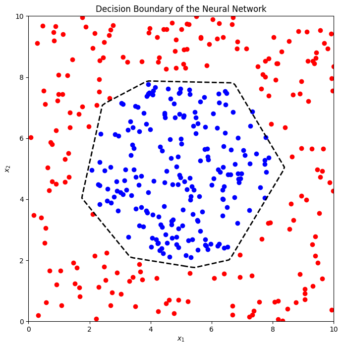
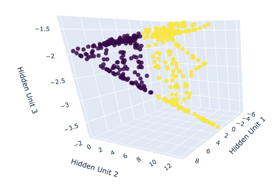

# SimpleNNViz
This beginner-friendly interactive [notebook](https://colab.research.google.com/github/killian31/SimpleNNViz/blob/main/circle_separ.ipynb) aims to help understand what's happening inside a simple neural network for binary classification on 2D data.

---

## Model Architecture
We study a simple neural network with 2 inputs, 2 hidden layers of dimension 10, a last hidden layer of dimension 3 and a binary output on which we apply the sigmoid function:

## 2-dimensional boundary

## 3-dimensional last hidden layer

